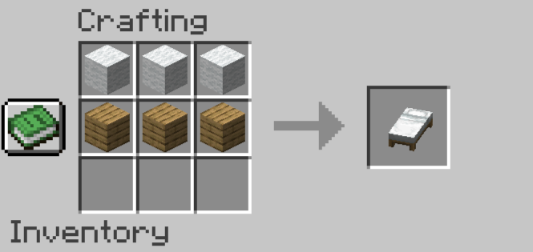



  <h1>Crafting</h1>

This page will guide you through the basics of crafting, which is essential to help you survive.

## Crafting table
To craft, you will need a crafting table. It can be crafted from your inventory directly, using 4 planks of any wood type. To obtain wood planks, you must collect wood, which can be done barehand. You can turn a wood log into planks directly using your inventory. One wood log will give you 4 planks, enough to craft a crafting table.

  

Once you have a crafting table, you can place it down and use it to craft upgraded tools and others. You will need a crafting table to craft all of the following items.

* * *

# Tools
To survive, you must craft tools to gather resources and defend yourself. Tools can be crafted with sticks and one other resource such as wood, stone, iron, gold, or diamonds. To learn how to gather these resources, go to [resources](resources).

Your first set of tools will be made of wood since you will need a pickaxe to gather upgraded resources.

## Axe
An axe helps you gather wood and things made of wood faster.

  

You need 2 sticks, and 3 planks for example.

## Pickaxe
A pickaxe helps you gather coal, stone, iron, gold, diamonds, and other minerals and ores. Be careful, gold, diamonds, emeralds, and redstone have to be mined using an iron pickaxe or better.

  

You need 2 sticks, and 3 cobblestones for example.

## Shovel
A shovel helps you gather dirt, sand, gravel, or clay.

  

You need 2 sticks, and 1 iron ingots for example.

## Hoe
A hoe helps you tilt dirt, to plant crops. It is essential to farming.

  

You need 2 sticks, and 2 iron ingots for example.

## Sword
A sword will help you defend yourself and kill mobs from up close.

  

You will need 1 stick, and 2 iron ingots for example. If you use a diamond sword, it will deal more damage than an iron or stone sword.

## Bow
A bow will help you defend yourself and kill mobs from a distance.

  

You will need 3 sticks and 3 strings, which can be obtained from spiders.

## Arrows
You will need arrows to shoot with a bow. They can be collected from skeletons, or crafted.

  

You need 1 stick, 1 feather, and 1 flint, which can be collected from gravel.

* * *

# Armor
To protect yourself from taking damage you will need armor. Armor can be made of leather, iron, gold, or diamond. Armor is made of 4 pieces: a helmet, a chestplate, leggings, and boots. Each item will protect one part of your body.

The guide below will teach you how to craft iron armor. If you want to craft leather or diamond armor, for example, you only need to replace iron with leather or diamond.

## Helmet

  

You need 5 iron ingots.

## Chestplate

  

You need 8 iron ingots.

## Leggings

  

You need 7 iron ingots.

## Boots

  

You need 4 iron ingots.

Tools and armor can be enchanted, see below to `enchanting table`.

* * *

# Others

## Bed
A bed will help you sleep through the night and avoid most of the hostile mobs. It is also used to reset your spawn point if you die.

  

You need 3 planks and 3 wool.

## Furnace
A furnace will help you cook meat and melt raw materials such as raw iron or raw gold. To activate it, you will need fuel such as coal, charcoal, or planks.

  

You need 8 cobblestones.

## Torches
Torches will help you light up dark areas or see your surroundings during nighttime, once placed down. Torches are essential when mining, to not be surprised by hostile mobs.

  

You need 1 stick and 1 coal or charcoal.

## Bucket
A bucket will help you contain liquids such as water, lava, or milk. It also allows you to grab mobs from the water such as tropical fishes.

  

You need 3 iron ingots.

## Boat
A boat will help you travel on water, making you go much faster than swimming. It can also be used to trap mobs.

  

You need 5 planks.

## Flint and Steel
Flint and steel help you light things on fire. It is essential to light up a Nether portal.

  

You need 1 iron ingot and 1 flint.

## Book
Books are used to craft bookshelves, to then craft an enchanting table.

  

You need 3 papers and 1 leather.

## Bookshelf
Bookshelves are used to craft enchanting tables. Bookshelves can also be placed around an enchanting table to make the enchantments better.

  

You need 3 books and 6 planks.

## Enchanting table
An enchanting table is another crafting station that allows you to enchant tools and armor. An enchanted item provides additional bonuses such as higher damage, protection, or efficiency for example.

  

You need 4 obsidians, 2 diamonds, and 1 book.

To enchant an item in the enchanting table menu, you can place the item in the slot, place lapis lazuli in the other slot, and choose an enchantment on the right.

## Anvil
An anvil is another crafting station that allows you to repair enchanted tools, rename items, or combine enchantments. 

  

You need 3 iron blocks and 4 iron ingots. To craft an iron block, you need 9 iron ingots.

  <h1>This is all you need to know about crafting to start playing!</h1>

