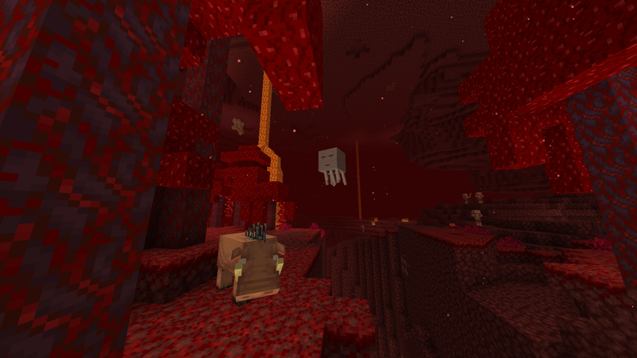



  <h1>Dimensions</h1>

Minecraft is the home of three distinct dimensions: the **Overworld**, the **Nether**, and the **End**.

The Overwolrd is the main dimension while others are more dangerous and can only be accessed via portals.

# The Overworld

  

The Overworld is the main dimension in Minecraft.

It is where you will spawn and where most mobs live. It includes **passive mobs** such as pigs, cows, sheep, horses, chickens, and villagers. **Neutral mobs** such as bees, spiders, wolves, enderman, and iron golems. **Hostile mobs** such as zombies, creepers, and skeletons.
However, you will discover *many more...*

The Overworld contains the most diverse biomes. The main biomes are plains, forests, mountains, deserts, and oceans.

It has a day and night cycle, nighttime being the time hostile mobs appear.

Many structures can be found around the Overworld, such as villages, desert temples, mineshafts, shipwrecks, ocean monuments, woodland mansions, and many more.

* * *

# The Nether

  

The Nether is a dimension that resembles hell. It has a dark scary atmosphere and is mostly made of Netherack.

The Nether is home to unique mobs such as piglins, ghasts, blazes, hoglins, magma cubes, and more. Enderman can also be found in the Nether.

The Nether contains its own biomes, such as Nether Wastes, Soul Sand Valleys, Crimson Forests, and more. You can find unique resources such as quartz or ancient debris.

There is no day and night cycle, but traveling from A to B is faster in the Nether than traveling from A to B in the Overworld.

To access the Nether you will need to go through a **Nether portal**. You can build one from scratch or repair a broken portal in the Overworld.

  

To build a portal you will need to:
- Build a frame 7-blocks high, with a 6-block width
- Build a smaller frame inside, 3-blocks high, with a 2-block width
- Pour lava into the mold
- Pour water over the lava to create obsidian
- Light the portal with a flint and steel (refer to [crafting](crafting)).

* * *

# The End

  

The End is the *final dimension* of Minecraft. It is a desert-ish dimension mostly made of End Stone.

The End contains its own biomes, mostly small islands and End cities, where rare resources and items can be found.

The End is home to many enderman and shulkers, and the Ender Dragon, which is the final boss of the game.

There is no day and night cycle.

To access the End you will need to go through an End portal. To learn how to access the End, and beat the Ender Dragon, please refer to [Ender Dragon](end-dragon).

  <h1>This is everything you need to know about dimensions and biomes to start playing!</h1>

