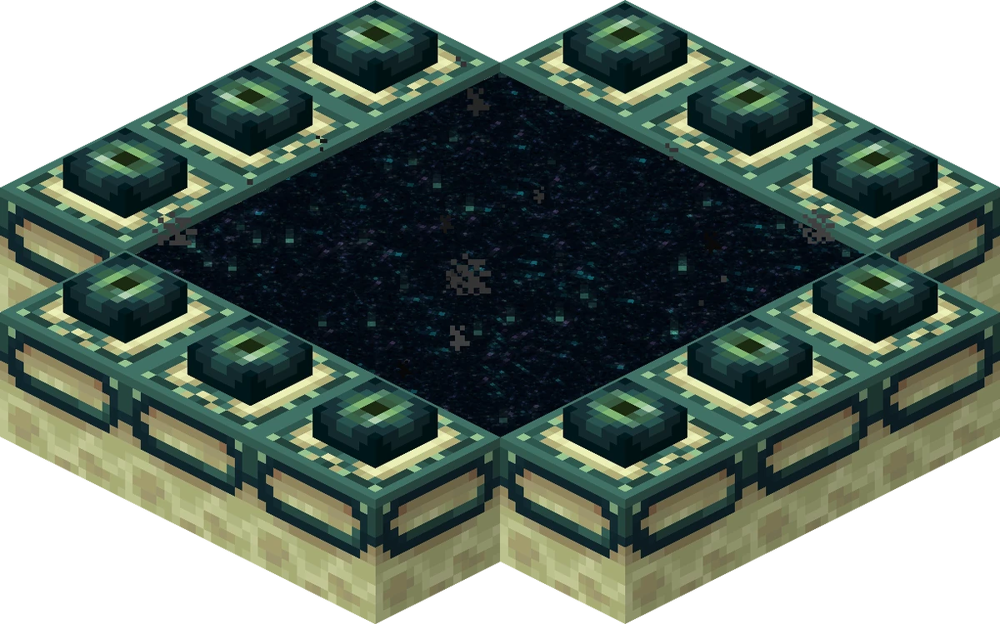



  

This page will guide you through defeating the Ender Dragon.

# 1) Locate the End portal
To kill the Ender Dragon, you will need to enter the End dimension, which can be done via the End portal.

You will need Eyes of Ender to locate it. To craft one Eye of Ender, you will need an Ender Pearl and Blaze Powder. You will need to craft 15-17 Eyes of Ender.

  
  
  
  
  

Ender Pearls can be obtained from killing Enderman, which can be found around the overworld but also in the Nether.

  

Blaze Powder can be obtained from Blazes, mobs who live in the Nether, in Nether fortresses. They shoot fireballs, therefore be ready for combat. Once killed, a Blaze will drop Blaze Rods.

  
  
  
  
  

One Blaze Rod can be converted into two Blaze Powders using a crafting table. You will approximately need 8-9 Blaze Rods.

  

You will use the Eyes of Ender to locate the Stronghold, which is where the portal is, and activate the portal. The portal requires 12 Eyes of Ender to be activated, although one is already in place. During your journey to locate the portal, you will need to throw Eyes of Ender in the air, which will fall into a certain direction, and follow this direction. The Eye of Ender can be collected again, and thrown in the air again, to indicate the direction to follow. However, an Eye of Ender has a 20% chance of breaking when you use it, which is why it is recommended to craft 15-17.
When you have arrived, the Eye of Ender will drop down on one block. You will need to dig down to reach the Stronghold, which is a structure, and find the End Portal room.

  

Once you have found the portal, you can activate it by placing the Eyes of Ender in the frame-blocks. But before entering the End, you will need to prepare.

# 2) Prepare
Before even attempting to kill the Ender Dragon, you will need to gear up. You will need to have :
- A full diamond body armor

It will absorb a great deal of the damage dealt by the dragon, and fall damage.
  
- A diamond sword

The sword will be used to directly attack the dragon, a diamond sword is strong and deals a lot of damage.
  
- A bow and arrows

The bow will be used to destroy the Ender Crystals, which help the dragon heal itself. A bow is needed since they are located on high pillars.
  
- A bucket of water

The bucket will be used to fall without taking any damage if you need it.

- Blocks

Blocks will be used to prevent fall damage, to reach higher areas, or to hide yourself.

- A pickaxe

The pickaxe will be used to mine blocks if you run out of them.
  
- Food

You will need to bring food to heal yourself, preferably golden carrots or golden apples.

Once you are ready, you can head back to the End portal, and jump through it to enter the End.

# 3) Destroy the Ender Crystals

  

Once you arrive in the End, you will be surrounded by Enderman and the Dragon will immediately attack you. Trying to shoot arrows or fight it with your sword will be useless if you haven't destroyed the End Crystals.

Try not to look at the Enderman, or they will attack you. If they do attack you, hide under a structure no more than 2 blocks high, and the Enderman won't be able to reach you, but you will be able to attack them.

  

Locate the obsidian pillars, where the End Crystals are located at the top. You can use your bow to shoot at them and destroy them, making them explode.

  

Taller pillars will require you to climb them up. Use blocks to tower up the pillars and shoot the End Crystal using your bow, but be careful of the explosion.

Some End Crystals are protected by metal pillars, which you will have to manually destroy using your pickaxe, before destroying them.

Once all of the End Crystals are destroyed, you can now attack the dragon.

# 4) Kill the End Dragon
The Ender Dragon flies in the air and throws fireballs at you. When the Dragon is in the air, shoot it using your bow and avoid the fireballs.

The Ender Dragon will occasionally come down in the center, in the End portal center, and is now vulnerable to melee attacks. This is the time to attack it with your sword. Be careful when the Dragon flies away because it will knock you back.

You can see the Dragon's health at the top of your screen, therefore knowing when it is going to die.

When the Dragon dies, it will explode in the air and drop a large amount of experience orbs. A Dragon Egg will appear on top of the End portal center, which you can collect. It is only a collectible item but remains a trophy.

You can return to the Overworld by jumping into the End portal, and the credits of the game will roll.

You have finished the game! You can now decide to explore the End, to find rare resources, or come back later, if you aren't scared...

