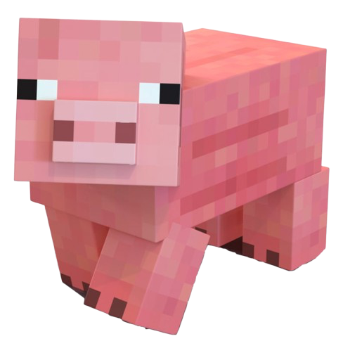
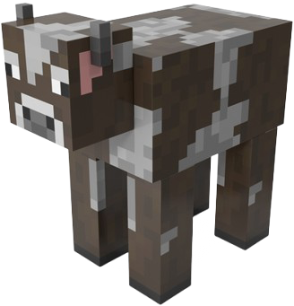
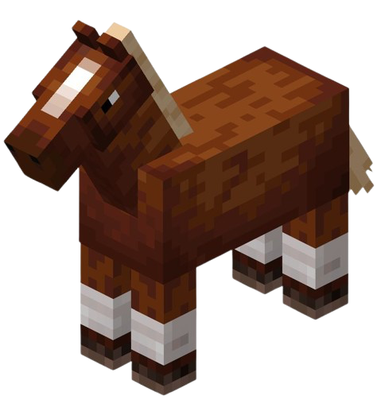
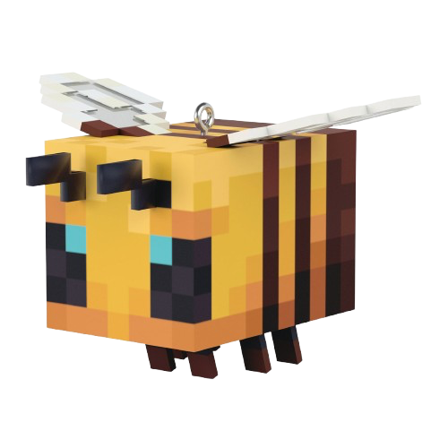
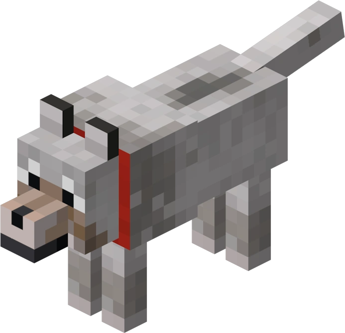
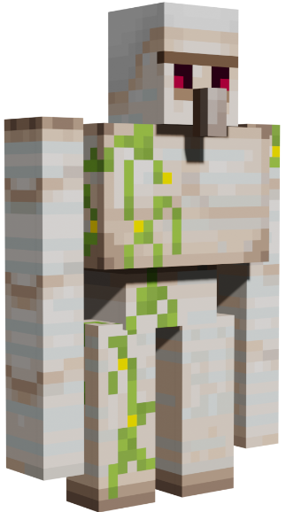
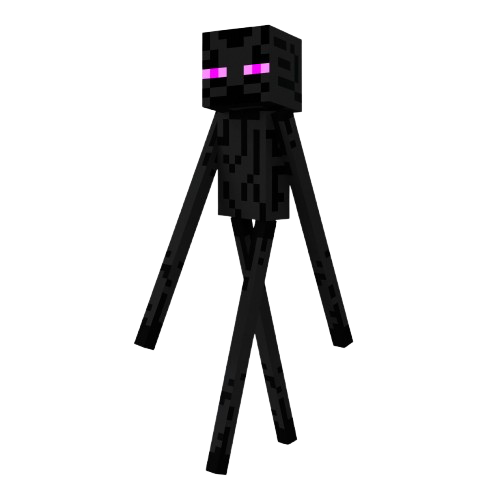
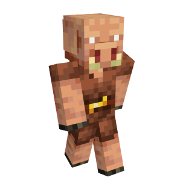



Mobs are living creatures who roam the world and with whom the player can impact.

There are three main types of mobs in Minecraft: passive mobs, neutral mobs and hostile mobs.

# Passive mobs
Passive mobs don't attack the player, even if the player attacks them.
Animals will drop food, which the player can cook and eat.
The most common passive mobs that a player will encounter are:

## Pigs

  

Pigs are common mobs that spawn in plains, forests, and taiga biomes.
Pigs can be bred using carrots, potatoes, or beetroots.
Pigs drop raw porkchop which can be cooked.

## Cows

  

Cows are common mobs that spawn in plains and forests.
A cow can be milked using a bucket. Cows can be bred using wheat. 
Cows drop raw beef, which can be cooked, and sometimes leather, which can be used to craft armor or books.

## Sheep

  

Sheep are common mobs that spawn in plains, forests, taiga, and mountain biomes.
Sheep drop raw mutton, which can be cooked, and wool. Wool can be obtained without harming a sheep using shears. Wool can be used to craft beds, carpets, and other decorative objects. Wool and sheep can be dyed in a large palette of colors but colored sheep can spawn, such as black sheep, brown sheep, or even pink sheep. Sheep can be bred using wheat.

## Horses

  

Horses are common mobs that spawn in plains and savanna biomes.
They come in various colors and patterns. Horses can be bred using golden apples or golden carrots.
A horse can be tamed and ridden by the player, to travel faster. A saddle is required for the horse to be controlled while riding. Saddles can be found in chests around the overworld or traded with villagers. An armor can also be equipped on the horse.
Horses drop leather. 

## Chickens

  

Chickens are common mobs that spawn in plains, forests, and swamps.
They can lay eggs, which the player can use in recipes such as cakes, or thrown to potentially spawn a baby chick. Chickens can be bred using seeds.
Chickens drop raw chicken and feathers.

Other passive mobs a player can encounter are cats, donkeys, squids, various types of fish or even parrots.

## Villagers

  

In Minecraft, various types of villagers can be found in villages. They can have different professions such as armorers, clerics, or shepherds but the most important and useful ones to the player are farmers, librarians, and blacksmiths. 

Their profession can be identified thanks to their specific clothing. A player can assign an unemployed villager to a profession by placing a job site block near them. For example, for a villager to become a librarian, a lectern needs to be placed near them.

The player can breed villagers by feeding them bread, and the grown adult will automatically be an unemployed villager. But each villager needs its own bed and food nearby.

The player can trade with villagers using emeralds, and gain useful resources such as enchantment books, enchanted tools or armor, or rare resources.

# Neutral mobs
Neutral mobs won't attack the player but will fight back if they are attacked.

## Bees

  

Bees spawn near flower-filled places.
They live in hives or nests and honey and honeycombs can be harvested using shears or bottles. Bees will attack the player if a bee is harmed, honey or honeycomb is collected without a campfire placed under, or if a nest is destroyed. Brees can be bred using flowers.

## Spiders

  

Spiders spawn in dark places such as caves, or at night, which are the only times they are hostiles.
Spiders drop strings and spider eyes. Strings can be used to craft bows or fishing rods. Otherwise, they will attack the player only if struck first.

## Wolves

  

Wolves spawn in forests.
Wolves can be tamed using bones and will follow the player, or be sat if the player doesn't want to, and attack enemies. Tamed wolves can be bred using any type of meat.

## Iron Golems

  

Iron Golems spawn in villages.
They protect villagers from hostile mobs, but can also be crafted by the player using iron blocks and a carved pumpkin.
Iron Golems drop iron. 

## Enderman

  

Enderman are tall neutral mobs that spawn in most biomes, and the Nether but are especially present in the End dimension.
They can teleport and pick up and put down blocks. They will only attack a player if a player looks at them or attacks them.
Endermen drop Ender pearls, which can be used to teleport or craft Eyes of Ender which are used to locate an End portal and go in the End dimension.

## Piglins

  

Piglins spawn in the Nether dimension.
They will attack the player if the player isn't equipped with a gold piece of armor.
Players can barter with piglins by giving them gold ingots, for which in exchange they will randomly get resources such as obsidian or potions.

# Hostile mobs
Hostile mobs will attack the player even if they aren't provoked.
Most hostile mobs spawn in dark areas such as caves, or during nighttime. Most of them die when the sun rises.

The most common hostile mobs a player can encounter are:

## Zombies

Zombies spawn in dark areas and during the night and die under the sunlight.
They will attack the player and can also attack villagers, turning them in zombie villagers.
They drop rotten flesh which can be eaten by the player but might poison them.

## Creepers

Creepers spawn in dark areas and during the night but don't die during daylight.
They are stealthy and explode near the player, dealing a lot of damage. They can be killed easily from a distance, or if the player has a cat, it will push them away.
Creepers drop gunpowder, which can be used to craft TNT and fireworks.

## Skeletons

Skeletons spawn in dark areas and during the night and die under the sunlight.
They are equipped with a bow and shoot arrows at the player, which makes them particularly dangerous.
Skeletons drop arrows and bones, which can be used to tame wolves.

Other common hostile mobs are witchers, pillagers...

## The Ender Dragon

The Ender Dragon spawns in the End dimension.
It isn't a common hostile mob since there is only one, and represents the "final boss".
It is a very powerful flying creature that attacks the player with fireballs.
The Ender Dragon drops a large amount of XP, and a dragon egg, which is a decoration item.
If you want to defeat the Ender Dragon, there is a guide at ...

