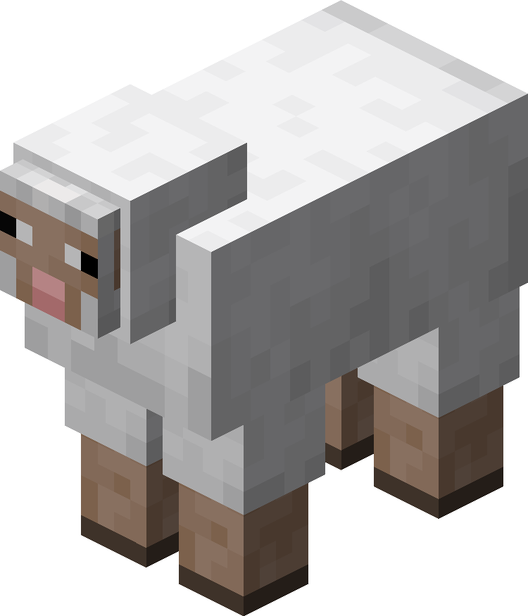
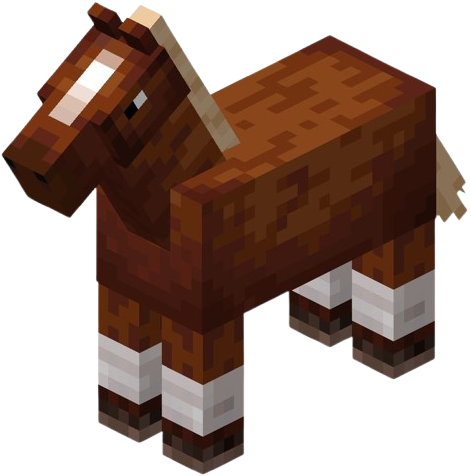
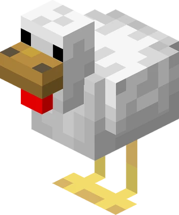



Mobs are living creatures who roam the world and with whom the player can impact.

There are three main types of mobs in Minecraft: passive mobs, neutral mobs and hostile mobs.

# Passive mobs
Passive mobs don't attack the player, even if the player attacks them.

The most common passive mobs that a player will encounter are:

- Pigs

  

- Cows

  

- Sheep

  

- Horses

  

- Chickens

  

- Villagers

  

They provide a source of food if the player kills them. They can be bred and help provide a stable source of food.

Other passive mobs a player can encounter are cats, donkeys, squids, various types of fish or even parrots.

# Neutral mobs
Neutral mobs won't attack the player but will fight back if they are attacked.

- Bees
- Spiders
- Wolfs
- Iron Golems
- Endermen
- Piglins

# Hostile mobs
Hostile mobs will attack the player even if they aren't provoked.

The most common hostile mobs a player can encounter are:

- Zombies
- Creepers
- Skeletons
- Witches
- Pillagers
- The Ender Dragon

Most of them spawn during nighttime and die if they are exposed to sunlight.
