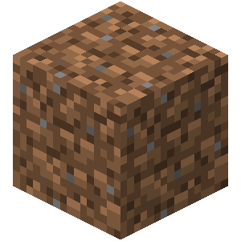
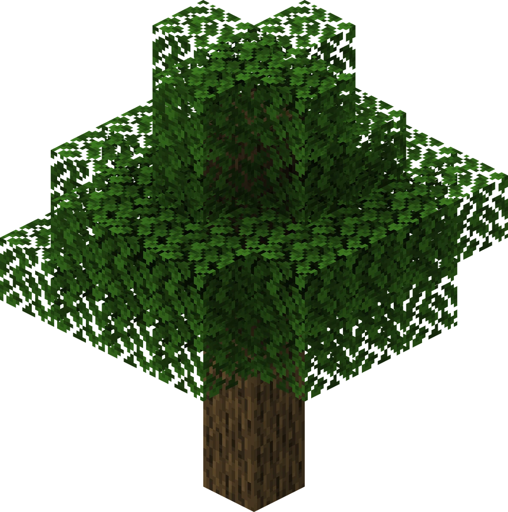
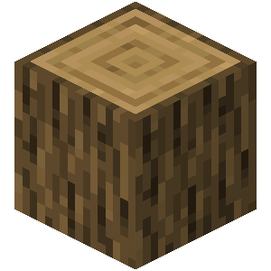



You will need to gather resources to survive and evolve in the game. Resources can be classified into three categories: natural resources, food, minerals and ores.

# Natural resources
## Dirt

  

Dirt is the most basic block in Minecraft, and it covers most biomes. As a new player, it is important to gather some dirt because it is always useful.
Dirt is often used at the beginning of a save to create a temporary base to survive through the first few couple of nights.
Dirt cannot be used to craft tools, but it is essential to farming. Crops can only grow on tilled dirt or glass blocks.
Moreover, having a stack of dirt blocks in your inventory might always be helpful, whether it is to build a temporary base, block yourself from dangerous mobs, or easily climb levels.
  
## Wood

  

  

  

Wood is a fundamental resource in Minecraft. It is the first resource you should look for because it is essential to gather almost all of the other resources.
Wood is obtained by chopping down a tree, which can be found almost everywhere. A tree can be chopped down barehand but it will be faster if the player uses an axe.
There are different types of trees, which can be found in different biomes. The most common are oak and birch trees.
Wood is used to craft planks, a very basic item. Planks are used to craft a large number of things, including sticks which are used to craft all of the essential tools such as pickaxes, axes, hoes, swords, and shovels.
Wood can be burned in an oven to create charcoal.
  
## Stone

Stone is another fundamental resource. It is the second resource a player usually looks for. It is easy to find in abundance underground or in mountains and caves.
Stone can be collected using a pickaxe, a wood pickaxe in the beginning. 
Once mined, stone will turn into cobblestone and can be used to craft stone tools, furnaces, and building blocks.
Stone is essential to building and can later be used to build advanced crafting stations.

## Water

Water can be found in rivers, oceans, lakes, underground, or small ponds. It can be collected using a bucket and used for a variety of things.
Water is essential to farming since crops need water to grow. It also allows the player to fish and therefore collect food but different items as well.
Water is also essential to seasoned players since it prevents fall damage. Players will keep a bucket of water in their inventory to purposefully (or not) fall down high grounds.
Water is also used to craft potions or make traps.
However, unlike food, the player doesn't need to drink to maintain themselves in survival mode.

# Food
A player needs to eat to restore their hunger, which will then restore their life.
You can eat different types of food, some are more nutritious than others.

## Meat
Meat is the easiest source of food to rely on when starting a save.
It is obtained from animals: cows, sheep, pigs, and chickens.
Meat can be cooked in a furnace, which will restore more of the player's hunger, rather than eating raw meat. Eating raw meat can also cause food poisoning.
Meat can be a reliable source of food if you decide to breed animals, kill them to get meat, cook it in order to eat it, and so on.

Fish can also be cooked and eaten.

## Vegetables
Vegetables are a reliable food source in Minecraft. Different types of vegetables can be found, such as wheat, carrots, potatoes or beetroots. They need to be planted in tilled dirt and will be ready to collect after a few in-game days. Carrots, potatoes, and beetroot seeds can be found in chests or villages around the world.
Wheat is the easiest crop to farm since it has to be planted from wheat seeds, which can be obtained from grass. Wheat can be used to make bread, but also to breed animals such as cows and sheep. Carrots are used to breed pigs and wheat seeds to breed chickens.
Potatoes can be cooked in a furnace, to restore more hunger.
Vegetables and fruits don't restore hunger as much as meat but can be harvested in large quantities at once.

## Fruits

Fruits are a less common source of food. Apples, melons, and sweet berries can be found around the world, but are harder to find than animals and vegetables. Apples can be found in chests or fall down from trees.
They are usually used to restore minimal hunger.

Carrots and apples can be turned into golden carrots and golden apples, to restore immediate health to the player.

# Minerals and Ores

## Coal

Coal can easily be found all around the world, usually underground, in mountains, or in caves. It can be mined with a wooden pickaxe or better.
It is essential to be used as fuel for furnaces or to craft torches, to light up dark areas. 

## Iron

Iron can be found all around the world, usually underground, in mountains, or in caves. It can be mined with a stone pickaxe or better.
Raw iron will be obtained from an iron ore after mining and can be turned into iron ingots if melted in a furnace.
Iron is used to craft various items, such as iron tools, armor, buckets, anvils, or even shields.
Iron tools provide greater effectiveness than stone tools and iron armor provides great protection. 
Iron can also be used to craft rails and minecarts, to move mods or travel easier.

## Gold

Gold can be found all around the world, usually underground, or in caves. It can also be found in the Nether dimension. It can be mined with an iron pickaxe or better.
Raw gold will be obtained from a gold ore after mining and can be turned into gold ingots if melted in a furnace.
Gold is rarer than iron, but less useful since gold tools and armor have the lowest durability. However, gold ingots are used to trade with piglins in the Nether, to obtain crucial equipment useful in the Nether. Gold ingots can also be used to make golden apples and golden carrots.
It can be used in advanced crafting, which makes it almost useless to beginners. 

## Diamonds
Diamonds can hardly be found all around the world, usually deep underground, or in caves. They can be mined with an iron pickaxe or better.
Diamonds are considered a rare and very valuable resource.
Diamonds can be used to craft the strongest tools and armor. Diamonds are also used to craft an enchantment table, which can enchant tools and armor, making them even more durable.

## Emeralds
Emeralds can hardly be found all around the world, usually deep underground, or in caves. They can be mined with an iron pickaxe or better.
Emeralds are also considered a rare and valuable resource.
Emeralds are used to trade with villagers, to obtain rare items that cannot be found in the world.

## Lapis lazuli
Lapis can be found all around the world, usually underground, or in caves. It can be mined with an iron pickaxe or better.
Lapis can be used in enchantment tables to enchant items and make them more durable or efficient. It can also be used as a dye.

Copper and redstone are other ores that you can encounter.
Redstone is used to create complex mechanisms such as mob farms and traps.
Copper is a recent addition to the game, and can mostly be used to craft decorative objects.

